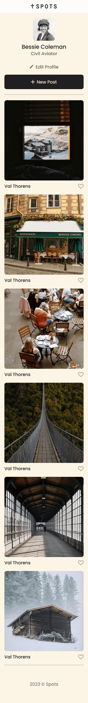
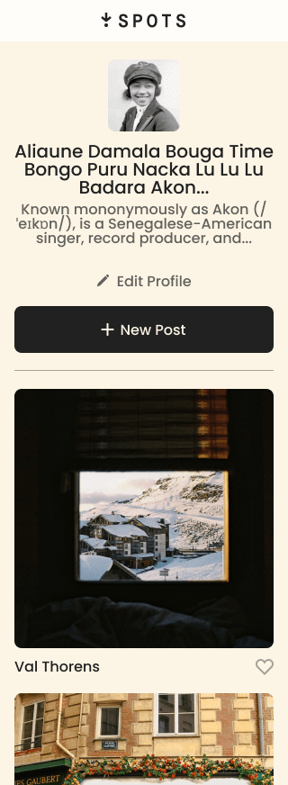

# Project 3: Spots

### Overview

- Intro
- Figma
- Images

**Intro**

This project is made so all the elements are displayed correctly on popular screen sizes. We recommend investing more time in completing this project, since it's more difficult than previous ones.

**Figma**

- [Link to the project on Figma](https://www.figma.com/file/BBNm2bC3lj8QQMHlnqRsga/Sprint-3-Project-%E2%80%94-Spots?type=design&node-id=2%3A60&mode=design&t=afgNFybdorZO6cQo-1)

**Images**

The way you'll do this at work is by exporting images directly from Figma — we recommend doing that to practice more. Don't forget to optimize them [here](https://tinypng.com/), so your project loads faster.

Good luck and have fun!

- 1440px spots app
  

- 1440px spots app with overflow
  

- Mobile spots app
  

- Mobile spots app overflow
  

- Components
  

**Deployed link**

- [Project 3: Spots](https://sofia-villazon.github.io/se_project_spots)

**Video about my project**

- [About Project 3: Spots](https://youtu.be/W-RybI_ma5o)
